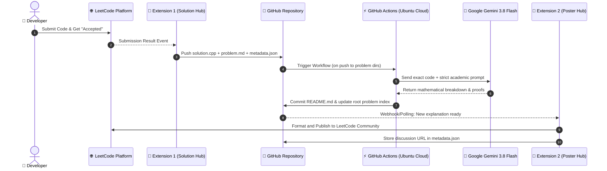

# ⚙️ How It Works: 100% Automated Cloud LeetCode Pipeline

<div align="center">

[](https://github.com/pragadheeshwar-d/leetcode-solutions/actions)
[](https://ai.google.dev/)
[](https://github.com/pragadheeshwar-d/leetcode-solutions)
[](README.md)

<p align="center">
  <b>A comprehensive deep dive into the architecture, cloud infrastructure, and AI automation that powers this repository.</b><br>
  Zero local processes. Zero manual copy-pasting. 100% cloud-native automation.
</p>

[🏆 View LeetCode Status](README.md) • [🔄 Architecture Pipeline](#-end-to-end-pipeline-architecture) • [🧩 Components](#-system-components) • [🤖 Gemini Engine](#-ai-explanation-engine-gemini-38-flash) • [⚙️ Setup & Config](#️-cloud-configuration)

</div>

---

## 🔄 End-to-End Pipeline Architecture

Whenever a problem is solved on LeetCode, the entire documentation and sharing cycle runs autonomously without any local software running on the user's computer:



---

## 🧩 System Components

The system is architected into three decoupled, failure-resilient components:

### 1. Browser Extension 1: LeetCode Solution Hub
- **Location**: Chrome Extension (Manifest V3)
- **Role**: Ingests accepted solutions immediately upon submission.
- **Workflow**:
  1. Intercepts the LeetCode GraphQL/REST submission responses.
  2. Verifies `status: "Accepted"`.
  3. Extracts the exact code, runtime, memory percentile, problem title, tags, and constraints.
  4. Generates a standardized folder name: `[problem_id]-[slug]` (e.g. `0021-merge-two-sorted-lists`).
  5. Computes a SHA-256 hash of the submitted code to prevent redundant runs.
  6. Pushes files via GitHub REST API:
     - `solution.<ext>`: The raw code file.
     - `problem.md`: Full problem statement and input/output examples.
     - `metadata.json`: State tracking, hash, and metadata.

---

### 2. Cloud Engine: GitHub Actions + Google Gemini 3.8 Flash
- **Location**: GitHub Cloud Runners (`ubuntu-latest`)
- **Workflow File**: `.github/workflows/generate_explanation.yml`
- **Script**: `.github/scripts/explain.py`
- **Role**: Automatically generates deep, publication-grade technical explanations without requiring any local PC compute.
- **Key Features**:
  - **Zero Local Burden**: You can submit from a laptop, phone, or tablet; the explanation is generated entirely in the cloud.
  - **High Concurrency & Speed**: Gemini 3.8 Flash delivers sub-3-second inference with high algorithmic precision.
  - **Deterministic Explanations**: A strict system prompt ensures the AI never hallucinates an alternative approach or rewrites your code.
  - **Self-Updating Master Index**: Automatically updates `README.md` and `LEETCODE_STATUS.md` with updated problem counts, badges, and indexed rows.

---

### 3. Browser Extension 2: LeetCode Poster Hub
- **Location**: Chrome Extension (Manifest V3)
- **Role**: Takes the AI-generated explanation from GitHub and publishes it directly to the LeetCode Solutions community.
- **Workflow**:
  1. Monitors the repository for problems marked `explanation_status: ready`.
  2. Pulls the generated `README.md`.
  3. Opens the LeetCode solution submission interface with pre-filled title, tags, and markdown body.
  4. Publishes the post and updates `metadata.json` with the resulting live discussion URL.

---

## 🤖 AI Explanation Engine (Gemini 3.8 Flash)

The explanation generator is governed by strict technical constraints configured in `.github/scripts/explain.py`:

```text
┌────────────────────────────────────────────────────────────────────────┐
│                   Strict AI Prompting Contract                          │
├────────────────────────────────────────────────────────────────────────┤
│ 1. Explain ONLY the user's exact submitted code.                       │
│ 2. DO NOT suggest or substitute an alternative algorithm.              │
│ 3. Trace actual variable names, pointers, loops, and conditions.       │
│ 4. Derive Time Complexity mathematically from the execution steps.     │
│ 5. Derive Space Complexity strictly from auxiliary memory allocated.   │
│ 6. Identify concrete edge cases handled by the solution.               │
│ 7. Preserve the submitted code verbatim in the final code block.       │
└────────────────────────────────────────────────────────────────────────┘
```

### Generated Explanation Structure:
Each problem folder's `README.md` contains 8 standardized sections:
1. `# [Problem Number]. [Problem Title]`
2. `## Problem`: Concise summary of requirements and constraints.
3. `## Approach`: High-level paradigm (e.g. Two Pointers, Dynamic Programming, Stack).
4. `## How the Solution Works`: Step-by-step logic tracing using exact variable names.
5. `## Algorithm`: Formal numbered procedural steps.
6. `## Why This Works`: Mathematical invariants and correctness proof.
7. `## Complexity`:
   - `### Time Complexity`: Detailed big-O derivation.
   - `### Space Complexity`: Auxiliary memory breakdown.
8. `## Edge Cases`: Boundary conditions tested and handled.
9. `## Solution`: The unmodified accepted source code.

---

## ⚙️ Cloud Configuration & Secrets

### GitHub Repository Secrets
The cloud runner authenticates with Google Gemini via GitHub Actions secrets:

| Secret Name | Purpose | Scope |
|:---|:---|:---|
| `GEMINI_API_KEY` | Authenticates API requests to Google Gemini 3.8 Flash | Repo Secret (Encrypted) |
| `GITHUB_TOKEN` | Automatically provided by GitHub Actions to commit and push changes | Repository Read/Write |

### GitHub Actions Trigger Definition
The workflow is triggered only when problem files are pushed, preventing infinite build loops:
```yaml
on:
  push:
    branches: [ main ]
    paths:
      - '[0-9][0-9][0-9][0-9]-*/**'
  workflow_dispatch:
```

---

## 📁 Standardized Problem Schema

```text
[0001-two-sum]/
├── solution.cpp          # Exact code accepted by LeetCode
├── problem.md            # Problem description, constraints & examples
├── README.md             # In-depth technical breakdown generated by Gemini 3.8 Flash
└── metadata.json         # State tracking & community post URL
```

### Sample `metadata.json`:
```json
{
  "problem_id": 21,
  "title": "Merge Two Sorted Lists",
  "slug": "merge-two-sorted-lists",
  "language": "cpp",
  "difficulty": "Easy",
  "solution_file": "solution.cpp",
  "solution_hash": "3be897686105100ad3f29dc36221d96dede3adc33c2f83192dc08f263c5cf594",
  "explanation_status": "ready",
  "post_status": "posted",
  "discussion_url": "https://leetcode.com/problems/merge-two-sorted-lists/solutions/8543999/21-merge-two-sorted-lists-technical-expl-h66q",
  "posted_at": "2026-09-28T04:22:39.907Z"
}
```

---

<div align="center">
  <sub>Designed for autonomous competitive programming • <a href="README.md">Return to LeetCode Status</a></sub>
</div>
