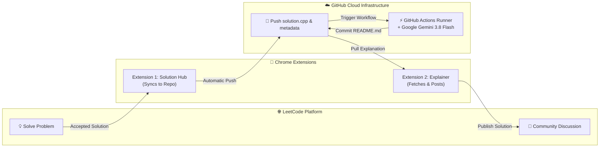

# ⚡ LeetCode Solutions & Deep Technical Explanations

<div align="center">

[](https://leetcode.com/)
[](https://github.com/pragadheeshwar-d/leetcode-solutions/actions)
[](https://ai.google.dev/)
[](https://en.cppreference.com/)
[](https://github.com/pragadheeshwar-d/leetcode-solutions)

<p align="center">
  <b>A fully automated, 100% cloud-native competitive programming repository.</b><br>
  Every LeetCode submission is synced to GitHub and automatically enriched with comprehensive, mathematically rigorous technical explanations generated by <b>Google Gemini 3.8 Flash</b>.
</p>

</div>

---

## 📑 Table of Contents
- [Architecture & Cloud Pipeline](#-architecture--cloud-pipeline)
- [Problem Index](#-problem-index)
- [Repository Structure](#-repository-structure)
- [Explanation Standards](#-explanation-standards)
- [Cloud Automation Setup](#-cloud-automation-setup)

---

## 🔄 Architecture & Cloud Pipeline

The entire documentation lifecycle runs autonomously without requiring local computing resources:



1. **Solve & Submit**: Code is submitted and accepted on [LeetCode](https://leetcode.com).
2. **Sync to GitHub**: Chrome Extension pushes the accepted code, metadata, and problem description directly to this repository.
3. **Cloud Analysis (Gemini 3.8 Flash)**: GitHub Actions runner automatically detects the new submission and prompts Gemini 3.8 Flash to write a full academic-grade breakdown of the *exact* implementation.
4. **Auto-Commit**: The generated explanation is committed directly back to the problem folder as `README.md`.
5. **Community Share**: The second extension reads the generated explanation and publishes it to the LeetCode Solutions community.

---

## 🏆 Problem Index

| # | Problem Title | Difficulty | Language | Solution | Deep Explanation | LeetCode Discussion |
|:---:|:---|:---:|:---:|:---:|:---:|:---:|
| `0009` | [Palindrome Number](https://leetcode.com/problems/palindrome-number/) | `🟢 Easy` | C++ | [solution.cpp](0009-palindrome-number/solution.cpp) | [📖 Read Breakdown](0009-palindrome-number/README.md) | [💬 Discussion Post](https://leetcode.com/problems/palindrome-number/solutions/8543304/9-palindrome-number-technical-explanatio-ljj2) |
| `0013` | [Roman to Integer](https://leetcode.com/problems/roman-to-integer/) | `🟢 Easy` | C++ | [solution.cpp](0013-roman-to-integer/solution.cpp) | [📖 Read Breakdown](0013-roman-to-integer/README.md) | [💬 Discussion Post](https://leetcode.com/problems/roman-to-integer/solutions/8543305/13-roman-to-integer-technical-explanatio-tu83) |
| `0014` | [Longest Common Prefix](https://leetcode.com/problems/longest-common-prefix/) | `🟢 Easy` | C++ | [solution.cpp](0014-longest-common-prefix/solution.cpp) | [📖 Read Breakdown](0014-longest-common-prefix/README.md) | [💬 Discussion Post](https://leetcode.com/problems/longest-common-prefix/solutions/8543306/14-longest-common-prefix-technical-expla-d88f) |
| `0020` | [Valid Parentheses](https://leetcode.com/problems/valid-parentheses/) | `🟢 Easy` | C++ | [solution.cpp](0020-valid-parentheses/solution.cpp) | [📖 Read Breakdown](0020-valid-parentheses/README.md) | [💬 Discussion Post](https://leetcode.com/problems/valid-parentheses/solutions/8543995/20-valid-parentheses-technical-explanati-w1at) |
| `0021` | [Merge Two Sorted Lists](https://leetcode.com/problems/merge-two-sorted-lists/) | `🟢 Easy` | C++ | [solution.cpp](0021-merge-two-sorted-lists/solution.cpp) | [📖 Read Breakdown](0021-merge-two-sorted-lists/README.md) | [💬 Discussion Post](https://leetcode.com/problems/merge-two-sorted-lists/solutions/8543999/21-merge-two-sorted-lists-technical-expl-h66q) |

---

## 📂 Repository Structure

Each problem is isolated into its own standardized directory:

```text
leetcode-solutions/
├── .github/
│   ├── workflows/
│   │   └── generate_explanation.yml   # Triggers Gemini 3.8 Flash runner on push
│   └── scripts/
│       └── explain.py                 # Core AI generator & README maintainer
├── 0009-palindrome-number/
│   ├── solution.cpp                   # Accepted source code
│   ├── metadata.json                  # Sync metadata & LeetCode discussion link
│   └── README.md                      # AI-generated deep explanation
├── 0021-merge-two-sorted-lists/
│   ├── solution.cpp
│   ├── problem.md                     # Problem statement & constraints
│   ├── metadata.json
│   └── README.md
└── README.md                          # Repository overview & master problem index
```

---

## 📝 Explanation Standards

Every auto-generated explanation strictly adheres to the following publication standard:

1. **Problem Statement**: Clear recap of requirements, inputs, outputs, and constraints.
2. **Core Intuition**: High-level conceptual approach and mental model.
3. **Step-by-Step Walkthrough**: Direct mapping to the actual code lines, variables, and control flow.
4. **Algorithmic Tracing**: Formal numbered steps representing the exact procedure.
5. **Mathematical Proof**: Theoretical correctness justification explaining why the invariants hold.
6. **Complexity Analysis**:
   - **Time Complexity**: Exact big-O notation derived mathematically from loops, branches, or recursion.
   - **Space Complexity**: Exact auxiliary memory analysis accounting for data structures or stack frames.
7. **Edge Cases**: Exhaustive breakdown of boundaries (e.g. empty inputs, single element, negative values, extremes).
8. **Verbatim Solution Code**: The unaltered, verified code submitted to LeetCode.

---

## ⚙️ Cloud Automation Setup

The cloud pipeline is configured entirely through GitHub:

- **Runner**: GitHub-hosted `ubuntu-latest`
- **Secrets**: `GEMINI_API_KEY` stored securely in Repository Secrets
- **Trigger**: Runs automatically on every `git push` modifying any problem folder, or manually via `workflow_dispatch`
- **Concurrency**: Guarded with cancellation groups to prevent race conditions during rapid submissions

---

<div align="center">
  <sub>Maintained by <a href="https://github.com/pragadheeshwar-d">@pragadheeshwar-d</a> • Powered by Google Gemini 3.8 Flash & GitHub Actions</sub>
</div>
